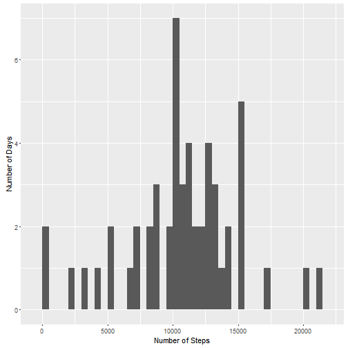
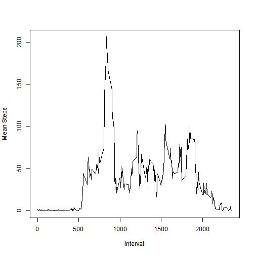
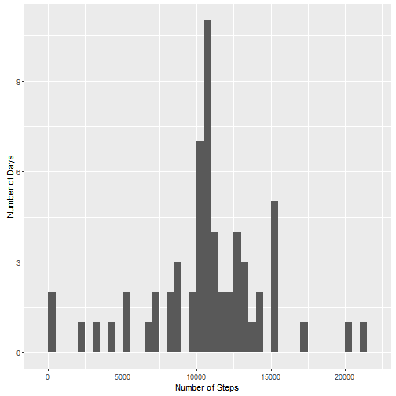
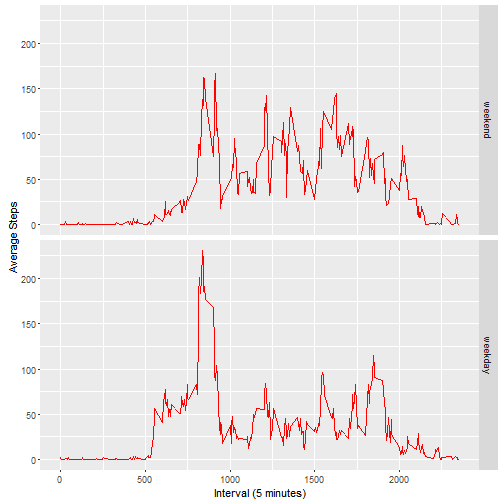

Load the required R packages.


```r
library(ggplot2)
library(dplyr)
library(sqldf)
```

Set working directory and read our pre-processed data set in.


```r
setwd('C:/Users/simon.monk/Documents/Data Science Course/Reproducible Research')
data <- read.csv("activity.csv")
```

Remove NAs from dataset and then remove any date factors that are no longer relevant because all associated data points are NAs.


```r
data.RemovedNAs <- data[!is.na(data$steps), ]
data.RemovedNAs$date <- factor(data.RemovedNAs$date)
```

## What is mean total number of steps taken per day?

Calculate the number of steps per day and plot them in a histogram.

```r
sumByDay <- as.data.frame(tapply(data.RemovedNAs$steps, as.factor(data.RemovedNAs$date), sum))
names(sumByDay) <- c("Steps")
qplot(sumByDay$Steps, geom="histogram", ylab="Number of Days", xlab="Number of Steps", binwidth = 500)
```

 

Calculate the mean and median total number of steps per day:


```r
print(mean(sumByDay$Steps), row.names = FALSE)
```

```
## [1] 10766.19
```

```r
print(median(sumByDay$Steps), row.names = FALSE)
```

```
## [1] 10765
```

## What is the average daily activity pattern?

Calculate the steps per interval averaged across all days and plot the results.

```r
meanStepsPerInterval <- tapply(data.RemovedNAs$steps, as.factor(data.RemovedNAs$interval), mean)
meanStepsPerInterval <- as.data.frame(meanStepsPerInterval)
meanStepsPerInterval$interval <- rownames(meanStepsPerInterval)
plot(meanStepsPerInterval$interval, meanStepsPerInterval$mean, type = 'l', ylab = "Mean Steps", xlab = "Interval")
```

 

Get the interval with the highest average number of steps on average.

```r
meanStepsPerInterval[meanStepsPerInterval$mean == max(meanStepsPerInterval$mean), ][1]
```

```
##     meanStepsPerInterval
## 835             206.1698
```

##Imputing missing values

Calculate and report the total number of missing values in the dataset 

```r
nrow(data[is.na(data$steps), ])
```

```
## [1] 2304
```

For all data points with NA steps, impute the average number of steps for that interval.

```r
meanStepsPerInterval$interval <- as.integer(meanStepsPerInterval$interval)
data.filledIn <- merge(data, meanStepsPerInterval, by = "interval")
data.filledIn$steps[is.na(data.filledIn$steps)] <- data.filledIn$meanStepsPerInterval[is.na(data.filledIn$steps)]
```

Calculate and plot a histogram of the numbers of steps per day using the newly created dataset

```r
sumByDay.filledIn <- as.data.frame(tapply(data.filledIn$steps, as.factor(data.filledIn$date), sum))
names(sumByDay.filledIn) <- c("Steps")
qplot(sumByDay.filledIn$Steps, geom="histogram", ylab="Number of Days", xlab="Number of Steps", binwidth = 500)
```

 

Calculate the mean and median total number of steps per day:

```r
print(mean(sumByDay.filledIn$Steps), row.names = FALSE)
```

```
## [1] 10766.19
```

```r
print(median(sumByDay.filledIn$Steps), row.names = FALSE)
```

```
## [1] 10766.19
```

##Are there differences in activity patterns between weekdays and weekends?

Create a factor variable that classifies each date as either a "weekday" or "weekend"

```r
data.filledIn$dow <- weekdays(as.Date(data.filledIn$date))

WeekdayFlags <- c('Monday', 'Tuesday', 'Wednesday', 'Thursday', 'Friday')
#Use `%in%` and `weekdays` to create a logical vector
#convert to `factor` and specify the `levels/labels`
data.filledIn$dtype <- factor(weekdays(as.Date(data.filledIn$date)) %in% WeekdayFlags, 
                   levels=c(FALSE, TRUE), labels=c('weekend', 'weekday'))
```

Calculate the steps per interval averaged across day type ("weekday" or "weekend") and plot the results in a time series.

```r
averages <- aggregate(steps ~ interval + dtype, data=data.filledIn, mean)
ggplot(averages, aes(interval, steps)) + geom_line(colour="red") + facet_grid(dtype ~ .) +
  xlab("Interval (5 minutes)") + ylab("Average Steps")
```

 
